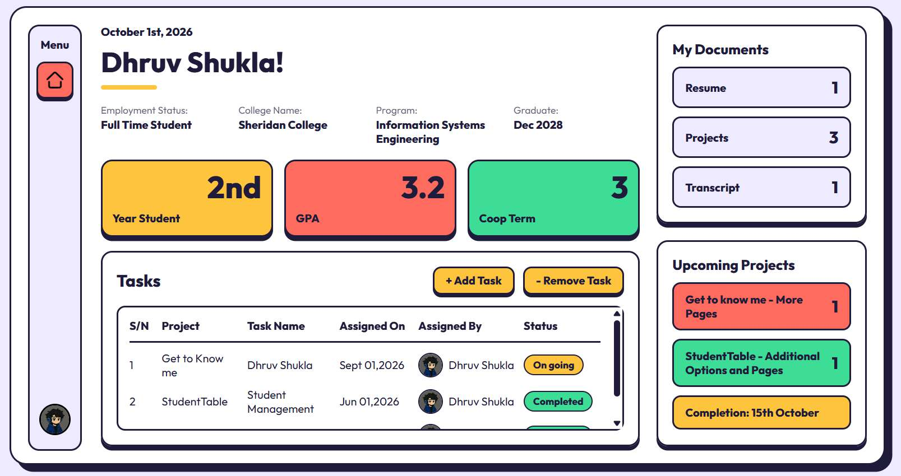

# 👋 Dhruv Shukla — About Me

<p align="center">
  <a href="https://dhruv-shukla-about-me.vercel.app">
    
  </a>
  <a href="https://github.com/shukladhruve777-blip">
    
  </a>
</p>

> **View the live site:** [dhruv-shukla-about-me.vercel.app](https://dhruv-shukla-about-me.vercel.app)

---

## 🌐 About This Project

This repository contains my personal portfolio / about-me web application.

The site is designed to give employers a quick way to see my background, projects, documents, and current work in one place.

## 🖥️ Portfolio Preview



## 🎯 What the Site Showcases

- 👨‍💻 Personal profile and student information
- 📚 Education and academic information
- 🧩 Software projects
- 📄 Resume and supporting documents
- 🛠️ Technical skills
- 🔗 Links to project work
- 📱 A browser-accessible portfolio experience

## 🛠️ Tech Stack

The repository includes a React application using:

- **React**
- **JavaScript**
- **Vite**
- **React Router**

## 📁 Project Structure

```text
Dhruv-Shukla-about-me/
├── App.py
├── README.md
└── React/
    ├── my-react-app/
    └── package-lock.json
```

## 🚀 Run Locally

```bash
git clone https://github.com/shukladhruve777-blip/Dhruv-Shukla-about-me.git
cd Dhruv-Shukla-about-me/React/my-react-app
npm install
npm run dev
```

Then open the local URL shown by Vite.

### Available Scripts

```bash
npm run dev
npm run build
npm run lint
npm run preview
```

## 💼 Why This Repository Matters

This project acts as a central, employer-friendly entry point to my development work. Instead of relying only on individual repository pages, visitors can use the live portfolio to quickly understand who I am, what I have built, and where to find the source code.

---

### 🔗 Links

**Live Portfolio:** https://dhruv-shukla-about-me.vercel.app  
**GitHub Profile:** https://github.com/shukladhruve777-blip

**Built with React • JavaScript • Vite**
